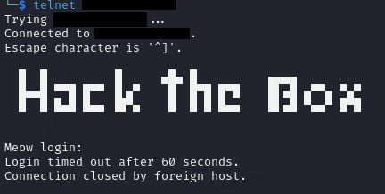

# Meow

### Enumeration

For this machine, basic enumeration using ping is sufficient to determine that the target is up.&#x20;

```
ping <target_ip>
```

Returns ten successful responses, indicating that the connection to our target is formed and stable. The ping command can be cancelled using CTRL+C in the terminal. The next stage will be to run nmap against the target to identify any open ports.&#x20;

```
nmap -sV <target_ip>
```

The only flag we use here is -sV which will return the name & description of any identified services. Running this against our target shows that port 23 is in an OPEN state and is serving telnet.&#x20;

Telnet is an old service which has been superseded by SSH. Telnet can be vulnerable if the default username/password have not been configured. To test this we can run telnet against the target to attempt to gain access.

```
telnet <target_ip>
```

<figure><figcaption><p>Output of telnet &#x3C;target_ip> on the target</p></figcaption></figure>


### Foothold

We have identified that telnet is available and accepting connections. The first test here is to use typical usernames like admin, administrator, and root. There are so few possibilities here that no automation is necessary.&#x20;

The username root allows us to make the telnet connection without a password. Using whoami on the target while connected confirms we are root. The flag.txt file that we are looking for is located in /root/flag.txt.

```
cat /root/flag.txt
```

Using cat on this files gives the desired output: 40abdfe23665f766f9c61ecba8a4c19.

### Lab Questions

1. What does the acronym VM stand for? **Virtual Machine**
2. What tool do we use to interact with the operating system in order to issue commands via the command line, such as the one to start our VPN connection? It's also known as a console or shell. **terminal**
3. What service do we use to test our connection to the target with an ICMP echo request? **ping**
4. What is the name of the most common tool for finding open ports on a target? **nmap**
5. What service do we identify on port 23/tcp during our scan? **telnet**
6. What username is able to log into the target over telnet with a blank password? **root**
7. Submit root flag. **40abdfe23665f766f9c61ecba8a4c19**
