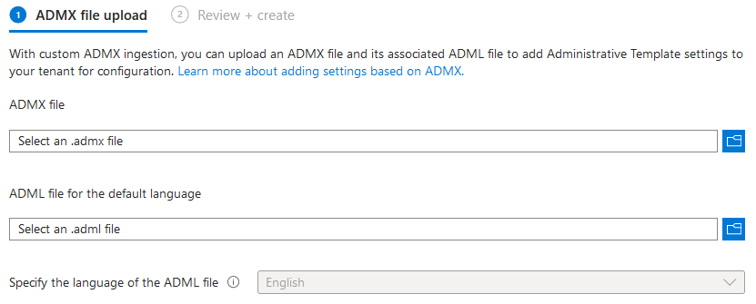

# ADMX Configuration

### Overview

Currently, Intune supports a maximum of twenty ADMX files being uploaded, each uploaded file has a maximum size of 1MB. For every imported ADMX, only one ADML file can be uploaded. Each ADMX file supports only one language, and only en-us ADML files are supported at the moment.

ADMX files may have dependency prerequisites which need to be imported first, if a dependency is not uploaded, an error message will list the missing namespace. For example, to import the Mozilla Firefox ADMX and ADML:

1. Import the `mozilla.admx` and `mozilla.adml` files, make sure status is **Available**.
2. Import the `firefox.admx` and `firefox.adml`.

If the `firefox.admx` file is imported before the `mozilla.adml` file, then the import will fail.

To check if an admx file has any dependencies, open the ADMX file in a text editor and look for using prefix in the `policyNamespaces` node. Some files may also require Windows.admx to be uploaded before they can be used, if this is the case, the following error message will be returned:&#x20;

```
ADMX file referenced not found NamespaceMissing:Microsoft.Policies.Windows. Please upload it first.
```

### Importing ADMX and ADML

Download and save the ADMX templates you wish to import and save them somewhere easy to access. Some common templates are:

* Mozilla Firefox
* Google Chrome
* Zoom

To import these, sign into Microsoft Intune and navigate to **Devices > Configuration > Import ADMX > Import**.&#x20;

<figure><figcaption><p>ADMX file upload screen.</p></figcaption></figure>

On the above page, select your ADMX file to upload, and then upload the ADML file for default language (remember only one can be added per ADMX!). Finally, specify the language of the ADML file. Once the import is completed, you will see your templates in the list under **"Import ADMX"**. From here, you will see the upload status of the template, the creation date of the template, the template name and the template version.

### Creating a Profile with ADMX

To create a profile using an imported ADMX, navigate to **Devices > Configuration > Create**, set the platform to **Windows 10 and Later** and choose **Templates > Imported Administrative Templates (Preview)** as the profile type. In the **Basics** screen, enter a good name and description for the profile and proceed to **Configuration Settings**. Here, choose the settings you wish to configure for your policy (depends on which ADMX import you are using, can be used to set bookmarks, configure auto-updates and so on).&#x20;

### Replacing Existing ADMX Files

If you wish to update an existing ADMX file, you can follow one of two procedures:

1. Replace the existing ADMX:
   * Delete any profiles using the existing ADMX settings.
   * Delete the original ADMX file which was imported.
   * Import the new ADMX and ADML files.
2. Create a new ADMX:
   * Create another version of the ADMX file with the same namespace as the original.
   * Add the new and different settings to this file.
   * Import the new ADMX and ADML files.

For more detail on specific configurations using ADMX please see [here](https://learn.microsoft.com/en-us/mem/intune/configuration/administrative-templates-windows).
