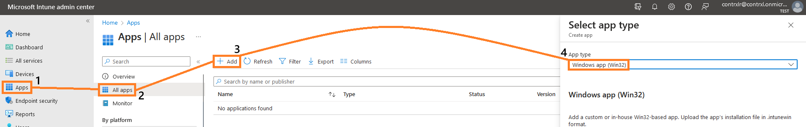

# App Deployment

### Deploying an Application via Intune

The Intune Management Extension (IME) is used to deploy Win32 applications to Intune. The IME allows applications or PowerShell scripts to be installed & run on targeted devices. A Win32 application will typically be a file with a .exe or .msi but Intune also allows the execution of .ps1, .cmd and .bat files for app or script installations.

### Prerequisites

Before you begin deploying an app to Intune, you will need to download the [Microsoft Win 32 Content Prep Tool](https://github.com/microsoft/Microsoft-Win32-Content-Prep-Tool). This tool allows you to package application or script files into a .intunewin extension file which you can then upload to Intune. Once you have installed this you will want to make three folders in a location of your choice:

1. C:\IntuneWinAppUtil : This is where you should save the Content Prep Tool executable.
2. C:\IntuneSource : This is where you should save any app installer files as well as any installation scripts.
3. C:\IntuneApps : This is the folder the Content Prep Tool will output your .intunewin files to.


These files can be stored anywhere and called whatever you like, as long as you know their names and paths. It is advisable to keep them grouped in a similar location for ease of access.


### Packaging your first App

Navigate to the location you saved your Content Prep Tool and launch the IntuneWinAppUtil.exe file. This will open a command prompt window which will first prompt you to specify the source folder for your app. In this example, we have created another folder inside C:\IntuneSource called TestApp so our source folder will be C:\IntuneSource\TestApp.

Next, you will be asked to provide the path to the setup file. For this example, the path will be C:\IntuneSource\TestApp\TestApp.exe. Finally, you will be prompted to specify an output folder. We created this earlier and so it will be C:\IntuneApps.

When asked if you wish to specify a catalog folder input **"N"**.&#x20;

<figure><figcaption>
Example of completed IntuneWinAppUtil.exe prompt
</figcaption></figure>

When this has finished running you will see your first .intunewin file under C:\IntuneApps.

### Deploying your first App

To deploy the app, head to the [Microsoft Intune Admin Center](https://intune.microsoft.com) and login with your administrator credentials. From here, select the **"Apps"** blade and then **"All Apps"** and select **"Add"**. For our app type we will select **"Windows App (Win32)."**&#x20;

<figure><figcaption>
Example of the sequence of clicks to open the app type blade
</figcaption></figure>

On the following screen, choose your .intunewin file created previously and then select **"OK"**. The form presented here only has three mandatory fields: **"Name"**, **"Description"** and **"Publisher"**. You should always be as detailed as possible here to avoid any issues in future if you have to come back to the application.

<figure><figcaption>
The "App Information" form for app deployment on Intune
</figcaption></figure>

The next step is the **"Program"** tab. Here we will specify an **"Install Command"** and an **"Uninstall Command"** as well as any installation or restart behaviours we wish to trigger. For our app installation parameters we will use TestApp.exe /install /qn and for uninstallation we will use TestApp.exe /uninstall /qn. Unless the app requires otherwise you should generally leave this on **"System."** Optionally, we can also set the **"Installation time required (mins)"** and **"Allow available uninstall."** These options allow you specify how long the system will wait for an installation to finish and whether users are able to uninstall the app on their own from the Company Portal respectively. For **"Device Restart Behaviour"** you can choose between four available options:

* Determine behaviour based on return codes : restart based on the post-installation return code.
* No specific action : do not restart or take any action post-installation.
* App install may force a device restart : device may restart depending on app requirements.
* Intune will force a restart : device always restarts post-installation.

The choice here is yours, typically I would set this to either **"No specific action"** for a fully silent install or **"App install may force a device restart"** if device behaviour does not matter.


Intune app deployments require a "Silent Install" switch, like "/qn", "/q" or "/s". If your app does not support silent installation it cannot be deployed. If you are not sure what your software's silent install switch is you can run "\<installer\_name.exe> /?" in PowerShell. If this does not work then [ITNinja](https://www.itninja.com/software-library/software) can be a good resource to identify the correct switch.


<figure><figcaption>
The "Program" tab for app deployment on Intune
</figcaption></figure>

Next, the **"Requirements"** tab allows you to set minimum system requirements. The only mandatory fields here are **"Operating System Architecture"** and **"Minimum Operating System."** Once these are set you can move on. The **"Requirements"** tab can be used for some advanced deployments but that will not be covered here.

<figure><figcaption>
The "Requirements" tab for an app deployment on Intune
</figcaption></figure>

The next tab, **"Detection Rules"**, will tell Intune where to look post-installation to confirm the app is actually installed. This can be done using manually configured rules or custom scripts. Manual configuration is the easier option and lets you create a basic rule that looks for a file, MSI or registry key that you specify (for some apps this may even auto-fill). A custom detection script lets you upload a .ps1 file of choice which will run after installation to identify the application based on your script. For this app, we will be using a manual detection rule with the parameters in the below screenshot.

<figure><figcaption>
The "Detection Rules" tab for an app deployment on Intune
</figcaption></figure>

The next options will be covered briefly; **"Dependencies"** and **"Supersedence."**

**"Dependencies"** allow you set a prerequisite or parent application. Intune will check to see if this application is installed first before attempting to install the new app. For example, if we only wanted TestApp to deploy to users who have TestApp2 installed then we could set TestApp2 as a dependency, meaning that only users with a detected TestApp2 install would receive TestApp1.

**"Supersedence"** allows you to specify an application for your app to overwrite or uninstall. For example, if we wanted TestApp to supersede TestApp2 we could set it as a supersedence and have it remove the old app, Intune would attempt to uninstall TestApp2 and then install TestApp in its place.

For this example we will not set any **"Dependencies"** or **"Supersedence"** and move on to **"Scope Tags."** These can help apply RBAC (Role-based Access Control), but again, we won't be using any here.&#x20;

Finally, we set the **"Assignments."** Here we have three options; **"Required"**, **"Available for Enrolled Devices"** and **"Uninstall."** Assigning groups to **"Required"** makes it a mandatory install for that group as long as all previous criteria are met. Assigning groups to **"Available for Enrolled Devices"** makes the app available via the Company Portal for that group. Assigning groups to **"Uninstall"** will attempt to uninstall the app for those users. Now select **"Review + create"**, once you have confirmed your settings are correct, proceed and wait for the app to upload. Patching and monitoring will be covered in App Patching and App Deployment.

<figure><figcaption>
Assignments page for our test app
</figcaption></figure>
