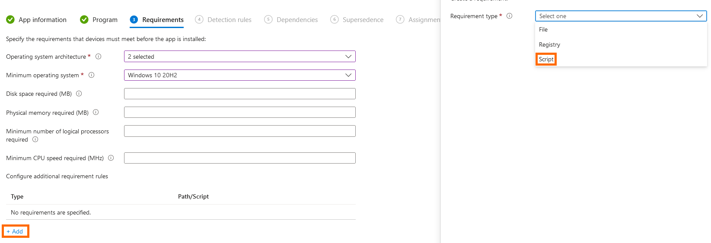
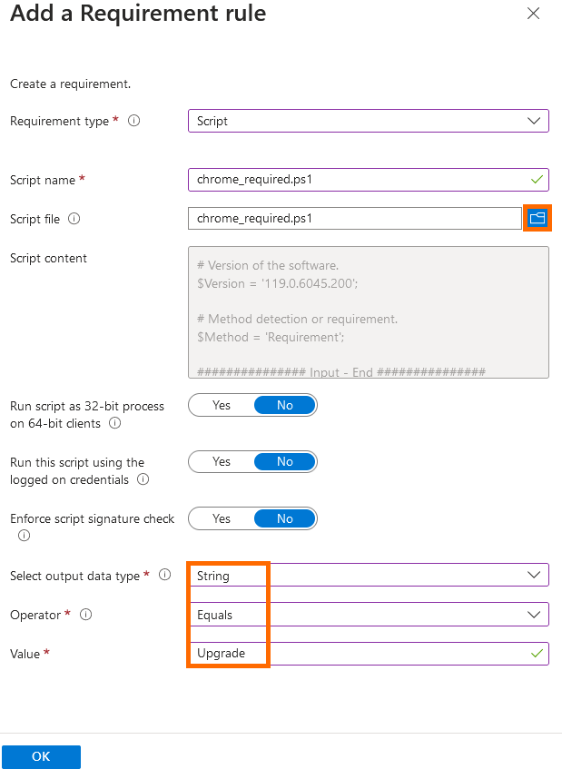
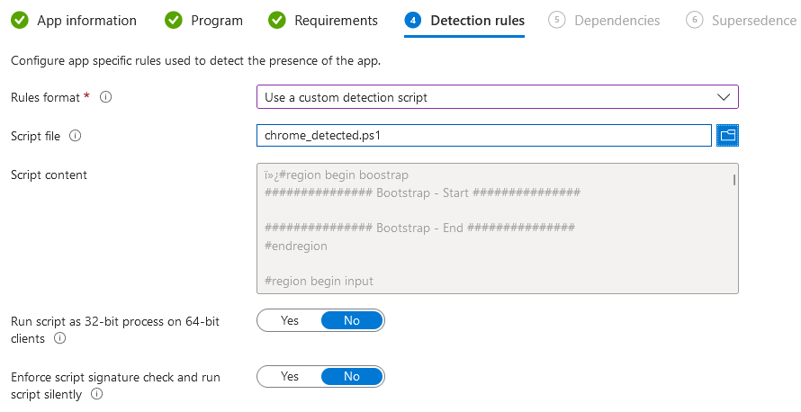

# App Updating/Patching

### Updating an Application Using Supersedence

App supersedence allows you to deploy an updated or modified version of an existing application. Supersedence can be configured to deploy your updated application and attempt to uninstall the old one, or it can be configured to deploy the updated application and overwrite the old one.

To deploy an app with supersedence, first create a new app on Intune by following App Deployment if necessary and proceed until you reach the **"Supersedence"** tab. Once we are in this tab, select **"Add"** and then search for and select the app which this will be superseding. The only option available to toggle here is **"Uninstall previous version"**. This determines whether the app will update the existing one or completely uninstall the old version and install fresh. This should be tested before deploying to all users as some applications may require a full reinstall to update correctly.&#x20;

\[SCREENSHOT TO BE ADDED]

Once this is decided, choose **"Review + save"** and deploy your application. This will now uninstall or update (depending on your choice) all existing deployments of the app. Once this is completed, you are safe to remove or set an exclusion on the previous app to make sure all future users get the correct installation straight away.

### Updating an Application Using Requirements

In some cases, supersedence is not a suitable option for updating an app. For instance, if our app is deployed as **"Available"** rather than **"Required"** then users who have installed an app already will often not get new software versions automatically. To remedy this, we create a hidden application in Intune which will use a requirement script to check for older versions. If an older version is found, the software will be updated.

The script we will be using for the **"Detection"** and **"Requirement"** components of our hidden app will be [Detect-InstalledSoftware.ps1](https://github.com/System-Admins/PowerShell/blob/main/scripts/microsoft/windows/software/detect-installedsoftware/Detect-InstalledSoftware.ps1). For this example, we will update Google Chrome. We will need two versions of this script. Save one version as ["detect-chrome.ps1"](https://github.com/contrxl/central/blob/main/examples/chrome\_detected.ps1) and save a second version as ["require-chrome.ps1"](https://github.com/contrxl/central/blob/main/examples/chrome\_required.ps1). In the "detect-chrome.ps1" script modify line 27 to:

```
$Name = 'Google Chrome';
```

Next, modify line 30 to:

```
$Version = '119.0.6045.200';
```

Finally, modify line 33 to:

```
$Method = 'Detection';
```

Make the same modifications to your "require-chrome.ps1" script except from line 33, which in the requirement script should be:

```
$Method = 'Requirement';
```

Proceed through creating a new app for Google Chrome as per instruction in [App Deployment](app-deployment.md) until you reach the **"Requirements"** tab. Here, we will create a requirement of type script to check for an existing install of Google Chrome.

<figure><figcaption><p>Select "Add" and then select type "Script" to upload the requirement script.</p></figcaption></figure>

&#x20;Once you have selected the requirement type as "Script", select the small blue folder to upload the "require-chrome.ps1" script. Now, on the bottom of the form select the output type as "String", the operator as "Equals" and type the value of "Upgrade".

<figure><figcaption><p>Requirement script blade completed.</p></figcaption></figure>

Select **"OK"** and then **"Next"** to proceed to the **"Requirements"** tab. In here, we will set our detection rule format to **"Use a custom detection script"** and upload "detect-chrome.ps1".&#x20;

<figure><figcaption><p>Custom detection script uploaded.</p></figcaption></figure>

Proceed through the rest of the tabs once this has been set until you reach **"Assignments"**. In here, assign the app to **"All Users"**. This will ensure that all users who have Chrome installed have their devices checked by the app, not just those who have downloaded it officially. The app will now run against all devices and check if Chrome is installed and on version 119.0.6045.200. If Chrome is installed and on a previous version, it will be updated to 119.0.6045.200. If Chrome is not installed, no action will be taken.

This process can be followed for any app that requires updating in this fashion using the same script.
