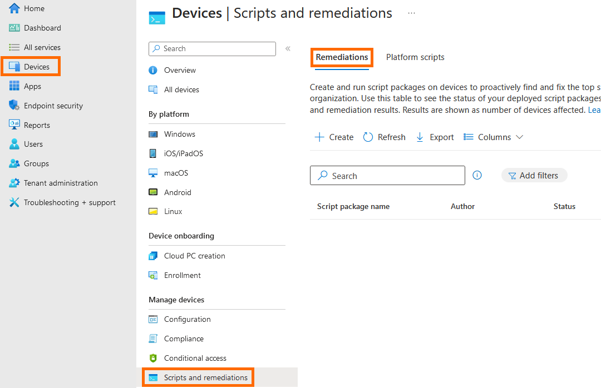
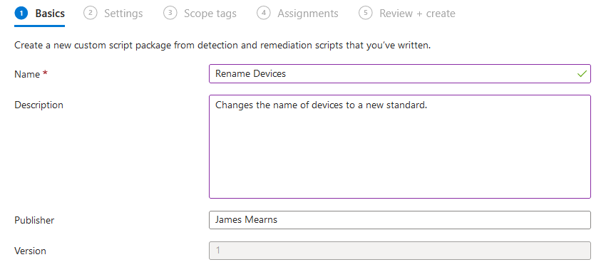
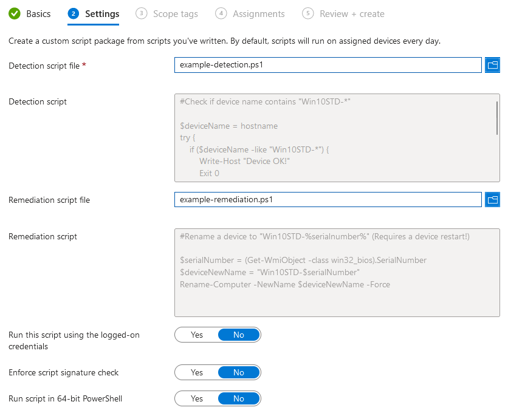
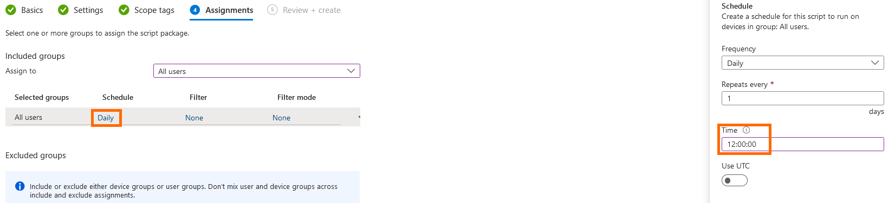
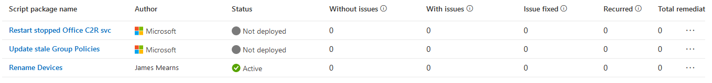

# Remediations

### Creating a Basic Remediation Script to Rename Devices

Intune remediation scripts can be run on users devices to identify and correct major issues. The remediations blade can be found under **"Devices"** then **"Manage Devices"** and **"Scripts and Remediations"**.

<figure><figcaption>
The "Scripts and Remediations" blade.
</figcaption></figure>

Remediations can be used to perform critical fixes to systems or software, or can be used to make low urgency changes to devices. Two examples will be covered here: renaming devices in your tenant, disabling Fast Startup (fast boot) on devices in your tenant.

First, we will cover renaming devices. To get started, press **"Create"** on the **"Remediations"** tab. The first step will be to enter the **"Name"**, **"Description"** and **"Publisher"** for our remediation. Only the **"Name"** field is required but you should always include as much detail as possible.

<figure><figcaption>
The "Basics" tab of remediation scripts.
</figcaption></figure>

Select **"Next"** to move on to the **"Settings"** tab. Here, we will need to upload our detection and remediation scripts. We will be uploading ["example-detection.ps1"](https://github.com/contrxl/central/blob/main/examples/example\_detection.ps1) and ["example-remediation.ps1"](https://github.com/contrxl/central/blob/main/examples/example\_remediation.ps1). PowerShell scripting will not be covered here but these are very basic scripts, the detection script will check if a device host name begins with "Win10STD-" and if it does not, the remediation script will change the device host name to "Win10STD-%serialnumber%".&#x20;

<figure><figcaption>
Completed "Settings" tab in remediation form.
</figcaption></figure>

For our purposes we do not need to change any of the default options here. In most cases, you will want to leave **"Run this script using the logged-on credentials"** as the default **"No"** to make sure your scripts run as the system rather than as the logged-on user (who will typically not have permission to execute scripts). The **"Enforce script signature check"** option should be left to **"No"** unless your script has been signed by a trusted publisher. Finally, if your script needs to run in 64-bit PowerShell you should change the **"Run script in 64-bit PowerShell"** option to **"Yes"**, for us this is not necessary so we will leave it as default.

Select **"Next"** to move to the **"Assignments"** tab. We will assign this remediation to all devices and set it to run once a day at 12:00:00. By selecting **"Daily"** you can also choose to have a script run hourly or only once. Once you have chosen your script schedule, choose **"Next"** and then **"Create"** on the **"Review + create"** tab.

<figure><figcaption>
The script schedule menu.
</figcaption></figure>

Finally, if you navigate back to **"Devices"**, under **"Manage Devices"** and **"Scripts and remediations"** you will see your newly created script with status **"Active"** as well as some columns indicating how the script rollout is progressing.

<figure><figcaption>
Scripts menu.
</figcaption></figure>

### Creating a Remediation Script to Disable Fast Startup on Windows Devices

Fast startup is often something that you want to have disabled on user devices by default to avoid any issues. Fast startup saves a machines OS state when it switched off to allow for a slightly quicker boot the next time the device is powered on. This means your device is never truly powered off, you can see this in Task Manager (if you have it enabled) - your device may show an up time of days or weeks despite having shut it down previously. Windows typically does not like being active for prolonged periods of time so it is best to disable this to eliminate it as a cause of issues for end users.

To create this remediation on Intune, follow through all of the above steps, using the scripts ["detect\_fastboot.ps1"](https://github.com/contrxl/central/blob/main/scripts/detect\_fastboot.ps1) and ["disable\_fastboot.ps1"](https://github.com/contrxl/central/blob/main/scripts/disable\_fastboot.ps1) as the **"Detection"** and **"Remediation"** scripts respectively. Once complete, set the schedule to whatever is suitable. Initially, I would suggest running this hourly to make sure you cover all your existing devices if it is enabled for all and then drop it down to running daily or every twelve hours.
